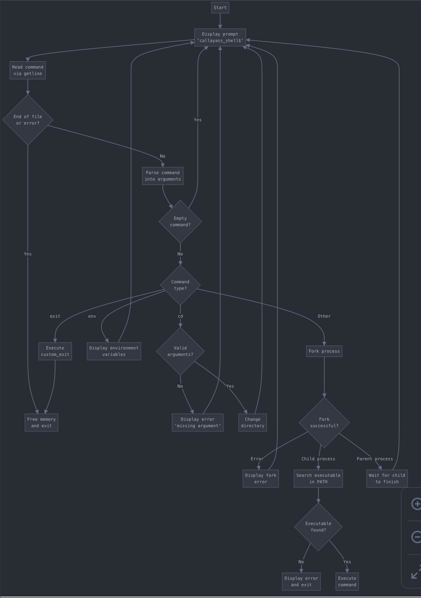

# Simple Shell
This project is about creating a simple shell. The shell is the command interpretor in an operating system such as Unix or GNU/Linux, it is a program that executes other programs. It provides a computer user an interface to the Unix/GNU Linux system so that the user can run different commands or utilities/tools with some input data.

# Files
- 1max_pid.sh
- AUTHORS
- README.md
- argument0.c
- exit.c
- flow.jpg
- getppid.c
- man_1_simple_shell
- pid.c
- shell.h
- simple_shell.c

# Flowchart



# Requirements

-   All your files will be compiled on Ubuntu 20.04 LTS using `gcc`, using the options `-Wall -Werror -Wextra -pedantic -std=gnu89`
-   All your files should end with a new line
-   A `README.md` file, at the root of the folder of the project is mandatory
-   Your code should use the `Betty` style.
-   Your shell should not have any memory leaks
-   No more than 5 functions per file
-   Use system calls only when you need to ([why?](https://intranet.hbtn.io/rltoken/rp53OodD6JzhS5Cv4DHkxQ "why?"))

# # Authorized functions and macros
- all functions from string.h
-   `access` (man 2 access)
-   `chdir` (man 2 chdir)
-   `close` (man 2 close)
-   `closedir` (man 3 closedir)
-   `execve` (man 2 execve)
-   `exit` (man 3 exit)
-   `_exit` (man 2 _exit)
-   `fflush` (man 3 fflush)
-   `fork` (man 2 fork)
-   `free` (man 3 free)
-   `getcwd` (man 3 getcwd)
-   `getline` (man 3 getline)
-   `getpid` (man 2 getpid)
-   `isatty` (man 3 isatty)
-   `kill` (man 2 kill)
-   `malloc` (man 3 malloc)
-   `open` (man 2 open)
-   `opendir` (man 3 opendir)
-   `perror` (man 3 perror)
-   `printf` (man 3 printf)
-   `fprintf` (man 3 fprintf)
-   `vfprintf` (man 3 vfprintf)
-   `sprintf` (man 3 sprintf)
-   `putchar` (man 3 putchar)
-   `read` (man 2 read)
-   `readdir` (man 3 readdir)
-   `signal` (man 2 signal)
-   `stat` (__xstat) (man 2 stat)
-   `lstat` (__lxstat) (man 2 lstat)
-   `fstat` (__fxstat) (man 2 fstat)
-   `strtok` (man 3 strtok)
-   `wait` (man 2 wait)
-   `waitpid` (man 2 waitpid)
-   `wait3` (man 2 wait3)
-   `wait4` (man 2 wait4)
-   `write` (man 2 write)
- No more

# Commande de compilation 
```
gcc -Wall -Werror -Wextra -pedantic -std=gnu89 *.c -o hsh
```


# Exemple 
./hsh
callayass_shell$ pwd 
/home/callacos/holbertonschool-simple_shell
callayass_shell$ ls -a
.   1max_pid.sh  AUTHORS       exit.c     .git                          hsh                 pid.c      shellexemp  simple_shell.c  
..  argument0.c  callayass_shell  getppid.c  holbertonschool-simple_shell  man_1_simple_shell  README.md  shell.h     testshell
callayass_shell$ exit 
# Testing
The test is done in parallel with the sh shell to see if the simple_shell responds like sh
```
valgrind --leak-check=full --show-leak-kinds=all ./hsh
==11630== Memcheck, a memory error detector
==11630== Copyright (C) 2002-2022, and GNU GPL'd, by Julian Seward et al.
==11630== Using Valgrind-3.22.0 and LibVEX; rerun with -h for copyright info
==11630== Command: ./hsh
==11630== 
callayass_shell$ exit
==11630== 
==11630== HEAP SUMMARY:
==11630==     in use at exit: 0 bytes in 0 blocks
==11630==   total heap usage: 3 allocs, 3 frees, 2,168 bytes allocated
==11630== 
==11630== All heap blocks were freed -- no leaks are possible
==11630== 
==11630== For lists of detected and suppressed errors, rerun with: -s
==11630== ERROR SUMMARY: 0 errors from 0 contexts (suppressed: 0 from 0)
```
```
./hsh
callayass_shell$ ls
1max_pid.sh  AUT exit.c holbertonschool-simple_shell  man_1_simple_shell  README.md shell.h
argument0.c  callayass_shell  getppid.c  hsh      pid.c    simple_shell.c
callayass_shell$ 
```
```
callayass_shell$ njn
njn: command not found
```
# Authors

Esteban Cratere  

Yassine Bouyanfif